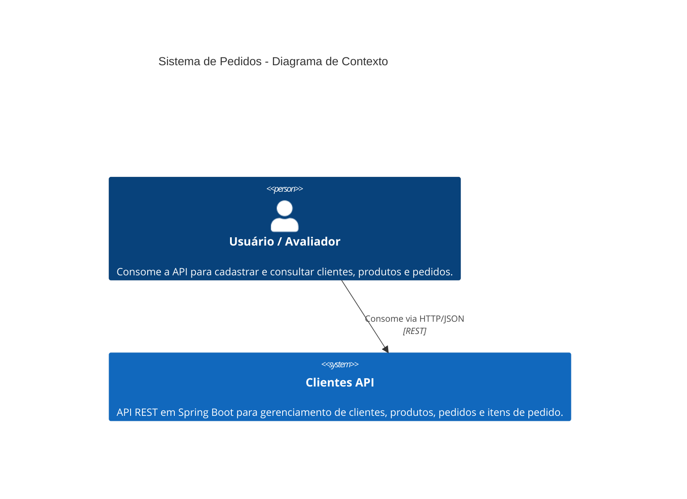
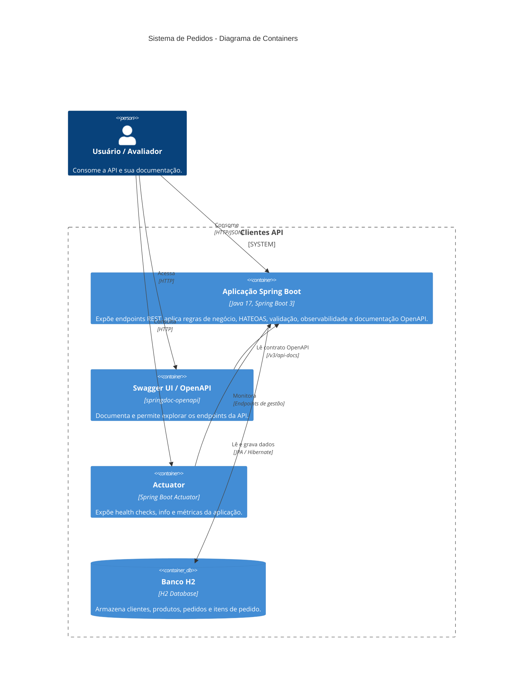

# Diagramas C4 em Mermaid

Este arquivo reúne o código Mermaid para representar a arquitetura da aplicação em três níveis do modelo C4:

- Contexto
- Containers
- Componentes

Observação: os diagramas abaixo usam a sintaxe `C4Context`, `C4Container` e `C4Component`, disponível em versões mais recentes do Mermaid.

## Nível 1 - Contexto

## Nível 2 - Containers

## Nível 3 - Componentes

```mermaid
C4Component
title Sistema de Pedidos - Diagrama de Componentes

Person(usuario, "Usuário / Avaliador", "Interage com a API REST.")
ContainerDb(h2, "Banco H2", "H2 Database", "Persistência relacional da aplicação.")

Container_Boundary(boundary_app, "Clientes API") {
    Component(clienteController, "ClienteController", "Spring MVC", "Expõe operações REST de clientes, busca, contagem e paginação.")
    Component(produtoController, "ProdutoController", "Spring MVC", "Expõe operações REST de produtos, busca, contagem e paginação.")
    Component(pedidoController, "PedidoController", "Spring MVC", "Expõe operações REST de pedidos, status, contagem e paginação.")

    Component(clienteService, "ClienteService / ClienteServiceImpl", "Service Layer", "Orquestra regras de negócio do domínio de clientes.")
    Component(produtoService, "ProdutoService / ProdutoServiceImpl", "Service Layer", "Orquestra regras de negócio do domínio de produtos.")
    Component(pedidoService, "PedidoService / PedidoServiceImpl", "Service Layer", "Orquestra regras de negócio do domínio de pedidos.")

    Component(pedidoBuilder, "PedidoBuilder", "Builder", "Centraliza a montagem do agregado Pedido e o cálculo do total.")

    Component(clienteRepository, "ClienteRepository", "Spring Data JPA", "Acesso a dados do domínio Cliente.")
    Component(produtoRepository, "ProdutoRepository", "Spring Data JPA", "Acesso a dados do domínio Produto.")
    Component(pedidoRepository, "PedidoRepository", "Spring Data JPA", "Acesso a dados do domínio Pedido.")
    Component(itemPedidoRepository, "ItemPedidoRepository", "Spring Data JPA", "Consulta vínculos de itens de pedido.")

    Component(mappers, "DTOs e Mappers", "DTO / Mapper", "Convertem entidades em contratos HTTP e adicionam links HATEOAS.")
    Component(exceptionHandler, "ApiExceptionHandler", "Controller Advice", "Padroniza respostas de erro 400, 404, 409 e 500.")
    Component(openApiConfig, "OpenApiConfig", "Configuration", "Configura documentação OpenAPI.")
    Component(loggingConfig, "LoggingConfig", "Configuration", "Configura logs de requisição e observabilidade.")
}

Rel(usuario, clienteController, "Consome endpoints de clientes", "HTTP/JSON")
Rel(usuario, produtoController, "Consome endpoints de produtos", "HTTP/JSON")
Rel(usuario, pedidoController, "Consome endpoints de pedidos", "HTTP/JSON")

Rel(clienteController, clienteService, "Invoca")
Rel(produtoController, produtoService, "Invoca")
Rel(pedidoController, pedidoService, "Invoca")

Rel(clienteController, mappers, "Usa")
Rel(produtoController, mappers, "Usa")
Rel(pedidoController, mappers, "Usa")

Rel(clienteController, exceptionHandler, "Delegação de tratamento")
Rel(produtoController, exceptionHandler, "Delegação de tratamento")
Rel(pedidoController, exceptionHandler, "Delegação de tratamento")

Rel(clienteService, clienteRepository, "Persiste e consulta")
Rel(produtoService, produtoRepository, "Persiste e consulta")
Rel(produtoService, itemPedidoRepository, "Verifica vínculos")
Rel(pedidoService, pedidoRepository, "Persiste e consulta")
Rel(pedidoService, clienteRepository, "Consulta cliente")
Rel(pedidoService, produtoRepository, "Consulta produtos")
Rel(pedidoService, pedidoBuilder, "Usa para montar o agregado")

Rel(clienteRepository, h2, "Lê e grava")
Rel(produtoRepository, h2, "Lê e grava")
Rel(pedidoRepository, h2, "Lê e grava")
Rel(itemPedidoRepository, h2, "Consulta")

Rel(openApiConfig, clienteController, "Documenta")
Rel(openApiConfig, produtoController, "Documenta")
Rel(openApiConfig, pedidoController, "Documenta")
Rel(loggingConfig, clienteController, "Observa")
Rel(loggingConfig, produtoController, "Observa")
Rel(loggingConfig, pedidoController, "Observa")
```

